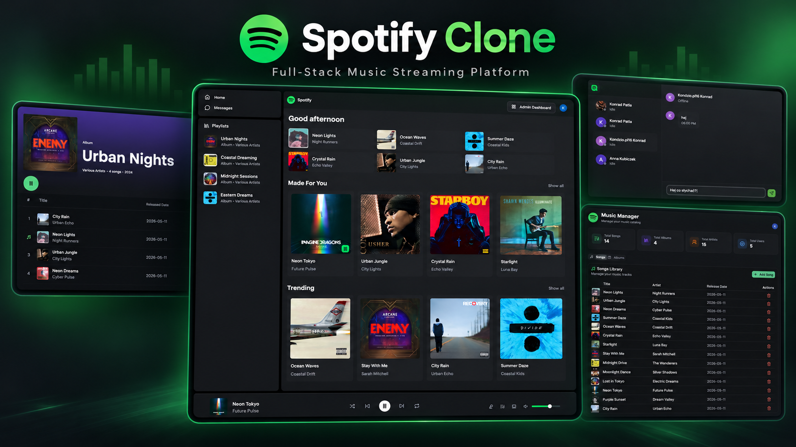

# Spotify Clone

A full-stack Spotify-inspired music app with an audio player, real-time chat, shared listening activity, and an admin dashboard for managing the music catalog.

**[Live demo → spotify.konradpatla.pl](https://spotify.konradpatla.pl)**



> Learning project built while following the **Codesistency** course and later extended as part of my full-stack development practice.

## Features

### Music player and catalog

- Browse featured songs, albums, and the “Made for You” and “Trending” sections.
- Open an album and play its tracks as a queue.
- Play and pause, skip to the next or previous track, seek, and adjust volume.
- Keep playback controls available while navigating between pages.

The home-page selections currently use random database samples rather than a personalized recommendation or popularity-ranking system.

### Real-time social features

- Sign in through Clerk, with Google authentication.
- Send direct messages with conversation history stored in MongoDB.
- See online status, typing indicators, and message read receipts.
- Receive new-message notifications and see unread conversations.
- Share current listening activity with other connected users.

### Admin dashboard

- View catalog statistics, including song, album, artist, and user counts.
- Create and delete songs and albums.
- Upload audio and cover images to Cloudinary.
- Restrict admin API routes to the Clerk account whose primary email matches `ADMIN_EMAIL`.

### Responsive interface

Desktop layouts include resizable panels and a listening-activity sidebar. On mobile, compact navigation provides access to the music library and chat while keeping playback controls available.

## Tech Stack

| Area | Technologies |
| --- | --- |
| Frontend | React 19, TypeScript, Vite, React Router |
| UI | Tailwind CSS, shadcn/ui, Radix UI, Lucide |
| Client state and requests | Zustand, Axios |
| Backend | Node.js, Express 5 |
| Database | MongoDB, Mongoose |
| Authentication | Clerk |
| Real-time communication | Socket.IO |
| Media storage | Cloudinary |
| File handling | express-fileupload, node-cron for temporary-file cleanup |
| Production hosting | Hetzner VPS, Docker, Caddy, MongoDB Atlas |

## Architecture

In production, Express serves both the REST API and the compiled React frontend from one application service. API requests use the `/api` prefix, and frontend routes are handled through an SPA fallback.

- **React** manages the interface, player state, and chat state.
- **Clerk** handles sign-in and provides authentication for protected API routes.
- **Express** handles catalog management, user data, messages, and statistics.
- **Socket.IO** runs alongside Express for live messaging and activity updates.
- **MongoDB** stores users, messages, songs, and albums.
- **Cloudinary** stores uploaded audio files and cover images.
- **Caddy** provides the public HTTPS entry point and proxies requests to the application container.

Messages are persisted in MongoDB; connected-user and listening-activity state is held in server memory.

## Project Structure

| Path | Purpose |
| --- | --- |
| `backend/src/controller/` | Request handlers for authentication, catalog, users, and statistics |
| `backend/src/routes/` | REST API routes |
| `backend/src/middleware/` | Authentication and admin authorization |
| `backend/src/models/` | Mongoose models |
| `backend/src/lib/` | Database, Cloudinary, and Socket.IO setup |
| `backend/src/seeds/` | Demo catalog seed scripts |
| `frontend/src/components/` | Shared UI and playback components |
| `frontend/src/layout/` | Desktop and mobile application layouts |
| `frontend/src/pages/` | Home, album, chat, authentication, and admin pages |
| `frontend/src/stores/` | Zustand state for music, playback, authentication, and chat |
| `frontend/public/` | Static assets and demo media |
| `screenshots/` | Application showcase |

## Local Development

### Prerequisites

- A recent Node.js release compatible with the frontend tooling, such as Node.js 24, and npm.
- A MongoDB database, locally or on MongoDB Atlas.
- A Clerk application with Google sign-in configured.
- A Cloudinary account for media uploads.

### 1. Clone and install

Run these commands from your terminal:

```bash
git clone https://github.com/konrad3211/Spotify-clone.git
cd Spotify-clone
npm ci --prefix backend
npm ci --prefix frontend
```

### 2. Configure environment variables

Create `backend/.env`:

```dotenv
PORT=5001
NODE_ENV=development
MONGODB_URI=your_mongodb_connection_string

CLERK_PUBLISHABLE_KEY=your_clerk_publishable_key
CLERK_SECRET_KEY=your_clerk_secret_key

CLOUDINARY_CLOUD_NAME=your_cloudinary_cloud_name
CLOUDINARY_API_KEY=your_cloudinary_api_key
CLOUDINARY_API_SECRET=your_cloudinary_api_secret

ADMIN_EMAIL=your_admin_email
```

Create `frontend/.env`:

```dotenv
VITE_CLERK_PUBLISHABLE_KEY=your_clerk_publishable_key
```

Use keys from the same Clerk application in both files. Set `ADMIN_EMAIL` to the primary email of the Clerk account that should manage the catalog. Keep secret keys in the backend environment only, and do not commit credentials.

### 3. Start both services

From the repository root, start the backend:

```bash
npm run dev --prefix backend
```

In a second terminal, start the frontend:

```bash
npm run dev --prefix frontend
```

Open **http://localhost:5173**. The API and Socket.IO server run on **http://localhost:5001**.

The development API/socket URLs and allowed frontend origin are configured for these ports. If you change them, update the corresponding client and server configuration as well.

### 4. Optional: load the demo catalog

The repository includes demo audio, cover images, and an album seed script.

**This script deletes existing songs and albums before inserting the demo catalog. Run it only against a development database.**

From the repository root:

```bash
cd backend
node src/seeds/albums.js
```

## Available Commands

Run these commands from the repository root:

| Command | Purpose |
| --- | --- |
| `npm run dev --prefix backend` | Start the API with automatic restarts |
| `npm run dev --prefix frontend` | Start the Vite development server |
| `npm run lint --prefix frontend` | Run frontend ESLint checks |
| `npm run build --prefix frontend` | Type-check and build the frontend |
| `npm run build` | Install backend/frontend dependencies and build the frontend |
| `npm start` | Start the backend |

## Production Deployment

The live application runs in Docker on a **Hetzner Linux VPS**, behind **Caddy** for reverse proxying and HTTPS. It uses **MongoDB Atlas** for persistence and **Cloudinary** for uploaded media.

To build and run the application directly on Linux or macOS, from the repository root:

```bash
npm run build
NODE_ENV=production npm start
```

Configure the backend environment before starting the server, and provide `VITE_CLERK_PUBLISHABLE_KEY` before building the frontend. Vite embeds that public key during the build.

Setting `NODE_ENV=production` enables Express to serve `frontend/dist` alongside the API. The root build script currently uses `npm install` internally.

Docker and reverse-proxy configuration are managed on the server and are not included in this repository. This repository currently does not contain a GitHub Actions CI/CD workflow.

## Project Scope

This is an educational and portfolio project inspired by Spotify, with its own music catalog. It is not affiliated with or endorsed by Spotify.

Shuffle, repeat, lyrics, and device-selection controls are currently visual placeholders.

## Author

**Konrad Patla** · [@konrad3211](https://github.com/konrad3211)
